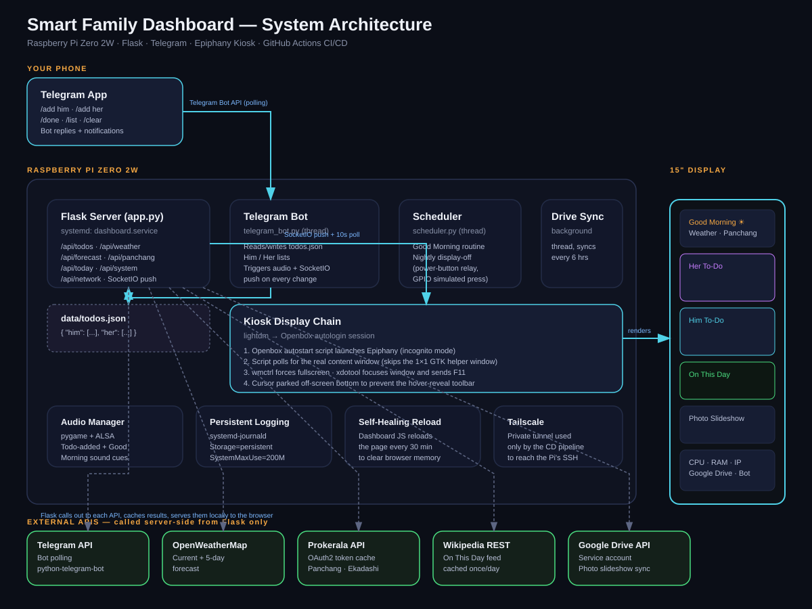
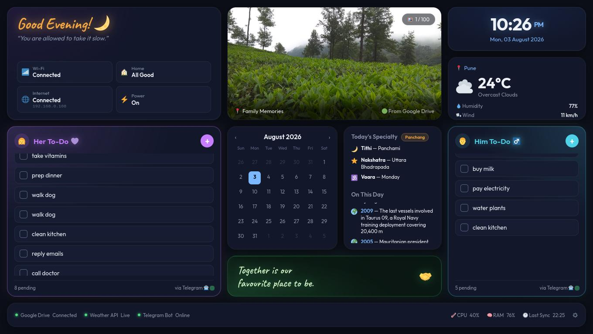

# 🏠 Smart Family Dashboard

> A Raspberry Pi Zero 2W powered smart home dashboard for our family —
> built entirely from scratch, with zero prior coding experience, as a
> complete hardware + software + DevOps project.



---

## About

This is a wall-mounted smart dashboard running on a Raspberry Pi Zero 2W
connected to a 15" display. It shows live weather with a 5-day forecast,
a shared Him/Her to-do list managed entirely via Telegram, a rotating
slideshow of family photos pulled automatically from Google Drive, today's
Hindu Panchang (tithi, nakshatra, vaara, Ekadashi detection), and real
world history facts for the day.

Everything is controlled from Telegram: adding and completing tasks,
and receiving a daily Good Morning cue with sound. The entire project is
deployed automatically — pushing code to GitHub tests it, and a passing
merge to `main` deploys straight to the Pi over SSH, with a Telegram
message confirming the deploy.

This project was built end-to-end by someone with **no prior coding
experience** — every piece, from the first `ssh` command to a working
CI/CD pipeline, was learned and built during this project.

---

## Features

- 📋 **Shared Him/Her to-do lists** — managed via Telegram bot (`/add`, `/done`, `/list`, `/clear`)
- 🌤️ **Live weather + 5-day forecast** — OpenWeatherMap, auto-refreshing
- 📸 **Family photo slideshow** — auto-syncs from a shared Google Drive folder, fixed-frame display so photo orientation never changes the layout
- 🕉️ **Hindu Panchang** — today's tithi, nakshatra, vaara, and Ekadashi detection, via the Prokerala API
- 🌍 **On This Day** — real world history facts pulled from Wikipedia's public API
- ☀️ **Good Morning routine** — daily cue with sound at 7:05 AM
- 🔊 **Audio alerts** — plays a sound when a new task is added, via a real speaker on the Pi
- 📡 **Live system status on-screen** — CPU, RAM, and the Pi's local IP address, so it can be reached over SSH at a glance without hunting for it
- 🔄 **Auto-scrolling to-do lists** — long lists scroll slowly on their own when they overflow the visible area
- 🖥️ **Boots straight to a full-screen kiosk display** — no keyboard, no mouse, no manual login, every time the Pi powers on
- 🤖 **Full CI/CD pipeline** — GitHub Actions tests every change and deploys automatically on merge to `main`

---



## Tech Stack

### Hardware
| Component | Purpose |
|-----------|---------|
| Raspberry Pi Zero 2W | Main compute unit |
| 15" HDMI display | The dashboard screen |
| USB sound card + speaker | Audio cues (Pi Zero has no built-in audio out) |
| Relay module (planned/optional) | Simulates a press of the display's physical power button on a schedule |

### Software
| Technology | Role |
|-----------|------|
| Python 3.11 | All backend services |
| Flask + Flask-SocketIO | Local web server and real-time browser push |
| python-telegram-bot | Telegram bot — todo commands |
| Google Drive API | Photo sync via a service account (no login popup on the Pi) |
| OpenWeatherMap API | Live weather and 5-day forecast |
| Prokerala API | Hindu Panchang, via OAuth2 client credentials |
| Wikipedia REST API | On This Day world history facts |
| pygame + ALSA | Audio playback |
| psutil | Real CPU/RAM stats shown on-screen |
| schedule | Timed jobs — Good Morning, nightly display control |

### Infrastructure
| Technology | Role |
|-----------|------|
| systemd | Runs the Flask app as a service, restarts it if it ever crashes |
| lightdm + Openbox | Manages the graphical session and auto-login, so the Pi boots straight to a working desktop with no manual login |
| Epiphany (WebKitGTK) | The kiosk browser — chosen over Chromium, which is too heavy for the Pi Zero's 512MB of RAM |
| wmctrl + xdotool | Force the browser window into a genuine full screen with no address bar, automatically on every boot |
| GitHub Actions | CI (lint + tests) and CD (deploy to the Pi) |
| Tailscale | A private network tunnel used only by the deploy pipeline, so GitHub's servers can reach the Pi without opening anything on the home router |

---

## Architecture

See [`docs/architecture.svg`](docs/architecture.svg) for the full diagram. In short:

- Your phone talks to the **Telegram Bot**, which reads and writes `data/todos.json` directly.
- **Flask** serves the dashboard page and a set of `/api/...` endpoints; it is the only thing that calls external APIs (weather, Panchang, Wikipedia, Drive) — the browser never talks to the internet directly.
- The **kiosk display chain** (lightdm → Openbox → Epiphany) shows the dashboard full screen, with no manual steps after power-on.
- The dashboard page polls Flask every 10 seconds and also receives instant updates over SocketIO the moment a Telegram command changes something.
- A **scheduler thread** handles the daily Good Morning cue and the nightly display routine.
- **GitHub Actions** tests every change and, on merge to `main`, connects to the Pi over Tailscale and deploys automatically.

---

## CI/CD Pipeline

### Continuous Integration — runs on every Pull Request

1. Installs Python dependencies from `requirements.txt`
2. Runs `flake8` for code style
3. Runs `pytest` — unit tests covering the to-do logic and the Ekadashi detection rule

If any step fails, the PR is blocked from merging.

### Continuous Deployment — runs on merge to `main`

1. GitHub Actions connects to the Pi over Tailscale
2. SSHes in and runs `git pull`, then `pip install -r requirements.txt`
3. Restarts the `dashboard` systemd service
4. Sends a Telegram message confirming the deploy

A push to `main` is live on the physical Pi within about two minutes, with no manual step.

### Branching

- `main` is the deployable branch — every real change goes through a Pull Request, never a direct push.
- Feature branches: `feature/*`, `fix/*`, `chore/*`.
- See [`CONTRIBUTING.md`](CONTRIBUTING.md) for the full workflow.

---

## Getting Started

### Prerequisites

- Raspberry Pi Zero 2W, Raspberry Pi OS
- Python 3.11+
- A Telegram bot token from [@BotFather](https://t.me/botfather)
- A free [OpenWeatherMap](https://openweathermap.org) API key
- A [Prokerala](https://api.prokerala.com) account for Panchang data
- A Google Cloud service account with the Drive API enabled

### Setup

```bash
git clone git@github.com:shenoiz/smart-family-dashboard.git
cd smart-family-dashboard

python3 -m venv venv
source venv/bin/activate
pip install -r requirements.txt

cp .env.example .env
nano .env   # fill in your keys

python main.py
```

Open `http://localhost:5000` in a browser to see it running.

For the full physical build — wiring, boot automation, and the kiosk
display setup — see [`docs/SYSTEM_NOTES.md`](docs/SYSTEM_NOTES.md). That
document captures every real fix from the actual build, including the
non-obvious ones.

### Telegram Commands

| Command | Example | What it does |
|---------|---------|---------------|
| `/add him <task>` | `/add him Buy milk` | Adds to Him's list, updates the screen instantly |
| `/add her <task>` | `/add her Book dentist` | Adds to Her's list |
| `/done him <number>` | `/done him 0` | Marks Him's item 0 as done |
| `/done her <number>` | `/done her 2` | Marks Her's item 2 as done |
| `/list` | `/list` | Shows both lists with item numbers |
| `/clear all` | `/clear all` | Removes completed items from both lists |

---

## Project Structure

```
smart-family-dashboard/
├── .github/workflows/
│   ├── ci.yml              # lint + tests on every PR
│   └── deploy.yml          # deploy to the Pi on merge to main
├── docs/
│   ├── architecture.svg    # the diagram at the top of this file
│   └── SYSTEM_NOTES.md     # detailed system-level build notes
|   └── dashboard-photo.jpg # dashboard html page snapshot
├── static/                 # sound files used by audio_manager.py
├── templates/
│   └── dashboard.html      # the display itself — HTML, CSS, and JS in one file
├── tests/
│   └── test_todos.py       # unit tests for the to-do logic and Ekadashi detection
├── app.py                  # Flask server and every /api/ route
├── audio_manager.py        # plays sound cues
├── config.py                # reads every setting from .env
├── google_drive_sync.py    # downloads photos from the shared Drive folder
├── main.py                  # starts every background service, then Flask
├── scheduler.py             # Good Morning cue, nightly display routine
├── telegram_bot.py          # the Telegram bot — all to-do commands
├── requirements.txt
├── .env.example
├── .gitignore
├── CONTRIBUTING.md
├── LICENSE
└── README.md
```

---

## What I Learned

I started this project with no prior coding experience. Here is what
building it actually taught me:

- **Linux and the terminal** — navigating the filesystem, managing
  services with systemd, SSH as a daily tool, reading kernel and X11
  logs to actually diagnose a problem instead of guessing
- **Python** — variables and functions through to threading, file I/O,
  JSON, and calling external APIs
- **Web fundamentals** — what a web server actually does, how Flask
  connects Python to a browser, and how SocketIO pushes updates without
  a page refresh
- **APIs** — OpenWeatherMap, Telegram's bot API, Google Drive's service
  account flow, and Prokerala's OAuth2 client-credentials flow
- **Linux graphics and display management** — the difference between a
  window manager and a display server, why a bare `startx` session has
  no window manager at all, VT (virtual terminal) permissions, and why
  `lightdm` exists as a real tool rather than "extra weight" — a lesson
  learned the hard way after a full day of hand-built alternatives
- **Real hardware debugging** — wiring a sensor, isolating a fault down
  to the component itself, and making the call to drop a feature rather
  than keep it in as something unreliable
- **Git and GitHub** — branching, Pull Requests, commit conventions, and
  the discipline of protecting `main` so nothing goes out untested
- **CI/CD** — writing real GitHub Actions workflows, understanding what
  automated testing catches that manual testing misses, and deploying to
  a physical device automatically, not just a cloud server

The single hardest part of this whole project was not any one bug — it
was the Epiphany kiosk boot chain. Getting a browser to launch
automatically, take over the full screen, and stay that way, on a
minimal Linux graphics stack with no window manager, took a full day and
went through several completely different approaches before the right
one (lightdm + Openbox + wmctrl + a properly-timed xdotool sequence)
actually held up. The detailed story of exactly what was tried, what
failed, and why, is written up in
[`docs/SYSTEM_NOTES.md`](docs/SYSTEM_NOTES.md) — including the parts
that look strange on paper (like deliberately nudging the mouse cursor a
couple of centimeters after the fullscreen sequence) but were the actual
fix, arrived at by testing on the real hardware rather than by theory.

---

## Roadmap

- [x] Flask server, dashboard UI, photo slideshow, weather
- [x] Telegram bot with Him/Her to-do lists
- [x] Google Drive photo sync
- [x] Hindu Panchang + On This Day
- [x] Live CPU/RAM/IP status on-screen
- [x] Full CI/CD pipeline — GitHub Actions test and deploy automatically
- [x] Fully automatic kiosk boot — no manual login, no manual browser launch
- [x] Persistent logging, so any future issue leaves real evidence
- [x] Self-healing 30-minute page reload to clear browser memory over time
- [ ] Physical relay wiring for true nightly display power-off with a morning wake
- [ ] Wall mount and final enclosure

**Dropped during the build, on purpose:**
- An RCWL-0516 motion sensor for automatic screen wake — wired up,
  tested in isolation down to the raw GPIO level, and found to be an
  unreliable unit. Removed rather than kept as a flaky feature. See
  `docs/SYSTEM_NOTES.md` for the full diagnosis.
- An IoT/MQTT smart-home command feature — scaffolded early on but never
  actually wired to real devices or tested, and removed cleanly before
  launch rather than shipped half-finished.

---

## About Me

Built as my first real software and hardware project, entirely from
zero prior experience — Python, Linux, Git, and a full CI/CD pipeline,
learned by building something my family actually uses every day.

🐙 [github.com/shenoiz](https://github.com/shenoiz)

---

_Built with a lot of patience, several full reboots, and one very
persistent debugging session that ended in a browser window that finally,
correctly, stayed full screen._
